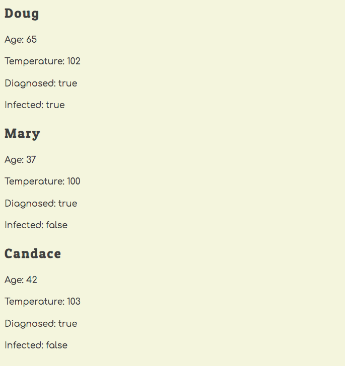

# Beginner JavaScript Review

## Coronavirus Tracker

In this exercise, your task to build a workflow for testing people for the coronavirus infection and then making that people who test poritive are put into isolation.

## Setup

1. Open your terminal and `cd` to your workspace directory.
1. Clone this project.
1. Once the project is cloned, `cd coronavirus` and then run `npm install`.
1. Once the installations are complete, run the `npm run test` command (_see animation below_). You will see all of the tests for your code - which ones pass, and which ones fail. As soon as you make changes to your code, the tests will run automatically, so keep this terminal window open while you are working on this project. When you need to stop working on it, use the `Ctrl+C` keyboard shortcut to stop the tests from running.


> **Note:** All of the code for this project will be created the `src` directory of the project. Open a new terminal session, and `cd` to the project directory again. Then you can `cd src` to change to that directory in your terminal. To check what's already in the `src` directory, use the `ls` command to see its contents.

## Pushing Your Code

Since you cloned an official NSS repository, you don't have permissions to push code to it. What you need to do is push to your own repository. Part of this assessment includes verifying that you make a minimum of 4 commits and pushes of your code.

1. Go to your Github page.
1. Create a new repository named `coronavirus`.
1. Copy the connection URL _(remember to make sure you use the SSH format, not HTTPS)_.
1. In your terminal, make sure you are currently in the project directory.
1. Run the command: `git remote remove origin`
1. Run the command: `git remote add origin paste_connection_url_here`


## Testing the Public

1. Create a `scripts/TestFacility.js` module.
1. Define a variable in the module to have the hold of the primary key for each piece of pottery _(i.e. the `id` property)_. It should have an initial value of 1.
1. Define and export a function named `testPerson`.
1. The `testPerson` function must accept the following values as input _(i.e. it needs parameters)_, in the following order.
    1. First name of the person being tested (e.g. "Kelly", "Peter")
    1. Age of the person (e.g. 31, 65)
    1. Person's temperature (e.g. 98, 103)
1. The `testPerson` function must return an object with the following properties on it. The `id` value should be incremented by 1 each time a person is tested.
    1. `firstName` whose value comes from the parameter
    1. `age` whose value comes from the parameter
    1. `temperature` whose value comes from the parameter
    1. `id` whose value comes from the incremented module variable

#### Checking Your Work

In the `main.js` module, invoke the `testPerson` function and provide the required values as arguments. Store the object that gets returned into a variable, and then use `console.log()` to view the object.

Also look at your terminal window that is running the tests and make sure that the `Person has been tested` test is passing.

Once you have it working, test 5 people in the `main.js` module.

**THEN PUSH YOUR CODE TO GITHUB**

## Clinical Consultation

1. Define a `scripts/Clinic.js` module.
1. Define a variable in the module that will store the people objects after they have been diagnosed in the clinic. It's initial value should be an empty array.
1. Define and export a function named `usePatients` which should return the array of diagnosed patients.
1. Define and export a function named `diagnose` that is responsible providing a diagnosis for a tested person.
1. The function must accept the following values as input _(i.e. it needs parameters)_, in the following order.
    1. An object representing a person who was tested with the `testPerson` function.
    1. A number specifying how many days the person has been symptomatic.
1. The function must add a new property of `diagnosed` with the value of `true` to the object. If you don't remember, you can easily [add new properties to objects in JavaScript](https://www.dyn-web.com/tutorials/object-literal/properties.php).
1. The function must also add a new property of `infected` to the object.
    1. If the person's temperature is above 101 and the number of days the person has been symptomatic is greater than, or equal to, 4 then `infected` property must have a value of `true`.
    1. Otherwise, the `infected` property must have a value of `false`.
1. After both of the new properties have been added, add the person to the array of diagnosed people. Recall which method is used to add new items to an array.
1. Finally, the function should return the augmented object.

#### Checking Your Work

In the `main.js` module, invoke the `diagnose` function for each of the 5 people who were test. Ensure you provide the required values as arguments. Store the object that gets returned into a variable, and then use `console.log()` to view the objects and make sure it has the right properties on each.

To check your work, make sure that at least one of the people is infected by providing a temperature that is too high, and a number symptomatic days being 4 or greater.

Also look at your terminal window that is running the tests and make sure that the following tests pass.

* `Person is diagnosed`
* `Person is infected when temperature and symptomatic days are too high`
* `Person is not infected when days are too few`
* `Person is not infected when no conditions met`

**THEN PUSH YOUR CODE TO GITHUB**

## Display the Catalog

Your next task is to create HTML representations of the people who have been tested and display them on the DOM.

### Define DOM Target

1. Create an `<article>` element in the `index.html` file.
1. The article element must have a class of `patients`.

### Create Patient HTML

1. Create a `scripts/PatientList.js` module.
1. Define and export a `PatientList` function.
1. The `PatientList` function must import that array of patients from the from the `Clinic.js` module.
1. The `PatientList` function must convert each object in the array to an HTML representation string. Use the following template to generate the representations. Recall the `${}` syntax for interpolating JavaScript variables into string templates.
    ```html
    <section class="patient" id="patient--1">
        <h2 class="patient__name">Doug</h2>
        <div class="patient__properties">
            <p>Age: 32</p>
            <p>Temperature: 101</p>
            <p>Diagnosed: true</p>
        </div>
        <div class="patient_diagnosis">
            Infected: false
        </div>
    </section>
    ```
1. Once all patient objects have been converted to HTML representation strings, append the inner HTML of the `<article>` element you created above with that string.

#### Checking Your Work

In the `main.js` module, invoke the `PatientList` component function. Make sure your web server is running, and then visit http://localhost:8080 and you should see your list of diagnosed patient. It should look similiar to this.



Then look at your terminal window that is running the tests and make sure that the following tests pass.

* `Patients are rendered to DOM`

**THEN PUSH YOUR CODE TO GITHUB**

